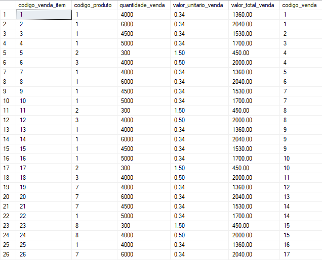

# ETL - Vendas

## Objetivo

Retirar e tratar os dados que estão no banco de dados do ERP e coloca-los no ETL para que não aja travamentos no sistema.
Aqui levamos em conta que ja restauramos o banco de dados do ERP de Vendas.

## Criando o banco

```sql
CREATE DATABASE ETL_Vendas
```

## Criando tabela do Vendedor e inserindo os dados a partir do ERP

```sql
CREATE TABLE Vendedor (
   codigo_vendedor      smallint not null,
   nome_vendedor        varchar(20),
   sexo_vendedor        varchar(1),
   perc_comissao        decimal(19,2),
   mat_funcionario      smallint not null
);

-- ADICIONANDO CHAVE PRIMARIA
ALTER TABLE Vendedor ADD PRIMARY KEY (codigo_vendedor);

-- INSERINDO DADOS DO VENDEDOR NO ETL UTILIZANDO OS DADOS DO ERP
INSERT INTO ETL_Vendas.dbo.Vendedor (codigo_vendedor, nome_vendedor, sexo_vendedor, perc_comissao, mat_funcionario)
SELECT cdvdd, nmvdd, sxvdd, perccomissao, matfunc
FROM ERP_Vendas.dbo.tbvdd;
```

## Tratando coluna sexo vendedor para ficar mais compreensível

```sql
UPDATE Vendedor
SET sexo_vendedor =
	CASE
		WHEN sexo_vendedor = '1' THEN 'M'
		WHEN sexo_vendedor = '0' THEN 'F'
	END;
```

## Consulta

```sql
SELECT * FROM Vendedor
```

## Resultado


## Criando tabela de Dependente e inserindo os dados a partir do ERP

```sql
CREATE TABLE Dependente (
   codigo_dependente      INT IDENTITY(1,1) PRIMARY KEY,
   nome_dependente        varchar(150),
   data_nascimento        date,
   sexo_dependente        varchar(2),
   codigo_vendedor        smallint,
   inep_escola			  varchar(10),
   CONSTRAINT FK_Dep_Vdd FOREIGN KEY (codigo_vendedor) REFERENCES Vendedor (codigo_vendedor)
)

-- INSERINDO DADOS DO DEPENDENTE NO ETL UTILIZANDO OS DADOS DO ERP
INSERT INTO ETL_Vendas.dbo.Dependente(nome_dependente, data_nascimento, sexo_dependente, codigo_vendedor, inep_escola)
SELECT nmdep, dtnasc, sxdep, cdvdd, inepescola
FROM ERP_Vendas.dbo.tbdep;
```

## Consulta

```sql
SELECT * FROM Dependente
```

## Resultado


## Criando tabela de Produtos e inserindo os dados a partir do ERP

```sql
CREATE TABLE Produtos(
    codigo_produto		INT IDENTITY(1,1) PRIMARY KEY,
    nome_produto		varchar(50) NULL,
    tipo_produto		varchar(1) NULL,
    unidade_produto		varchar(2) NULL,
    sl_produto			int NULL,
    status_produto		varchar(50) NULL
);

-- INSERINDO DADOS DO PRODUTO NO ETL UTILIZANDO OS DADOS DO ERP
INSERT INTO ETL_Vendas.dbo.Produtos(nome_produto, tipo_produto, unidade_produto, sl_produto, status_produto)
SELECT nmpro, tppro, undpro, slpro, stpro
FROM ERP_Vendas.dbo.tbpro;
```

## Consulta

```sql
SELECT * FROM Produtos
```

## Resultado


## Criando tabela de Venda e inserindo os dados a partir do ERP

```sql
CREATE TABLE Venda(
    codigo_venda		INT IDENTITY(1,1) PRIMARY KEY,
    data_venda			date NULL,
    codigo_cliente		smallint NULL,
    nome_cliente		varchar(50) NULL,
    idade_cliente		smallint NULL,
    classific_cliente	smallint NULL,
    sexo_cliente		varchar(1) NULL,
    cidade_cliente		varchar(50) NULL,
    estado_cliente		varchar(50) NULL,
    pais_cliente		varchar(50) NULL,
    canal_venda			varchar(12) NOT NULL,
    status_venda		smallint NULL,
    deleteda			smallint NULL,
    codigo_vendedor		smallint NULL
);

-- ADICIONANDO CHAVE ESTRANGEIRA DE VENDA COM VENDEDOR
ALTER TABLE Venda ADD CONSTRAINT "fk_venda_vendedor" FOREIGN KEY ( codigo_vendedor ) REFERENCES Vendedor ( codigo_vendedor );

-- INSERINDO DADOS DA VENDA NO ETL UTILIZANDO OS DADOS DO ERP
INSERT INTO ETL_Vendas.dbo.Venda(data_venda, codigo_cliente, nome_cliente, idade_cliente, classific_cliente, sexo_cliente, cidade_cliente, estado_cliente, pais_cliente, canal_venda, status_venda, deleteda, codigo_vendedor)
SELECT dtven , cdcli , nmcli , agecli, clacli, sxcli, cidcli, estcli, paicli, canal, stven, deleted, cdvdd
FROM ERP_Vendas.dbo.tbven;
```

## Criando nova coluna para colocar a situação da venda por extenso

```sql
ALTER TABLE Venda
ADD situacao_venda varchar(50) NULL;
```

## Inserindo dados na nova coluna de acordo com o status da venda

```sql
UPDATE Venda
SET situacao_venda =
	CASE
		WHEN status_venda = '1' THEN 'Concluída'
		WHEN status_venda = '2' THEN 'Em Aberto'
		WHEN status_venda = '3' THEN 'Cancelada'
	END;
```

## Consulta

```sql
SELECT * FROM Venda
```

## Resultado


## Criando tabela de Itens da Venda e inserindo os dados a partir do ERP

```sql
CREATE TABLE VendaItem(
    codigo_venda_item		INT IDENTITY(1,1) PRIMARY KEY,
    codigo_produto			int NULL,
    quantidade_venda		int NULL,
    valor_unitario_venda    decimal(18, 2) NULL,
    valor_total_venda		decimal(29, 2) NULL,
    codigo_venda			int NULL
);

-- ADICIONANDO CHAVE ESTRANGEIRA DE VendaItem COM PRODUTOS
ALTER TABLE VendaItem ADD CONSTRAINT "fk_vendas_item_produto" FOREIGN KEY ( codigo_produto ) REFERENCES Produtos ( codigo_produto );

-- ADICIONANDO CHAVE ESTRANGEIRA DE VendaItem COM VENDA
ALTER TABLE VendaItem ADD CONSTRAINT "fk_vendas_item_venda" FOREIGN KEY ( codigo_venda ) REFERENCES Venda ( codigo_venda );

-- INSERINDO DADOS DE ITENS DA VENDA NO ETL UTILIZANDO OS DADOS DO ERP
INSERT INTO ETL_Vendas.dbo.VendaItem(codigo_produto, quantidade_venda, valor_unitario_venda, valor_total_venda, codigo_venda)
SELECT cdpro , qtven , vruven, vrtven, cdven
FROM ERP_Vendas.dbo.tbven_item;
```

## Inserindo valor total da venda

```sql
UPDATE VendaItem
SET valor_total_venda = valor_unitario_venda * quantidade_venda
```

## Consulta

```sql
SELECT * FROM VendaItem
```

## Resultado



## Criando tabela exclusiva para Clientes

Com os dados do cliente que possuimos na tabela de Venda, podemos criar uma tabela separada para os clientes.

```sql
CREATE TABLE Cliente(
    codigo_cliente		INT IDENTITY(1,1) PRIMARY KEY,
    nome_cliente		varchar(50) NULL,
    idade_cliente		smallint NULL,
    classific_cliente	smallint NULL,
    sexo_cliente		varchar(1) NULL,
    cidade_cliente		varchar(50) NULL,
    estado_cliente		varchar(50) NULL,
    pais_cliente		varchar(50) NULL,
);
```

## Inserindo dados distintos

Possuimos dados repetidos na tabela de Venda, pois um cliente pode fazer varias compras. É importante tratar os dados para que não cadastrar clientes repetidos.

```sql
-- INSERINDO CLIENTES SEM QUE TENHAM REGISTROS DUPLICADOS
INSERT INTO ETL_Vendas.dbo.Cliente(nome_cliente, idade_cliente, classific_cliente, sexo_cliente, cidade_cliente, estado_cliente, pais_cliente)
SELECT DISTINCT nmcli , agecli, clacli, sxcli, cidcli, estcli, paicli
FROM ERP_Vendas.dbo.tbven;
```

## Consulta

```sql
SELECT * FROM Cliente
```

## Resultado


## Dimensoes e Fatos

Agora vamos criar o banco de dados das dimensoes e dos fatos.

```sql
CREATE DATABASE Dim_Fat_Vendas
```

## Dimensão do Vendedor e inserindo dados

```sql
CREATE TABLE D_Vendedor (
   codigo_vendedor      INT IDENTITY(1,1) PRIMARY KEY,
   nome_vendedor        varchar(20),
   sexo_vendedor        varchar(1),
   perc_comissao        decimal(19,2),
   mat_funcionario      smallint not null
);

INSERT INTO Dim_Fat_Vendas.dbo.D_Vendedor (nome_vendedor, sexo_vendedor, perc_comissao, mat_funcionario)
SELECT nmvdd, sxvdd, perccomissao, matfunc
FROM ERP_Vendas.dbo.tbvdd;
```

## Dimensão do Dependente e inserindo dados

```sql
CREATE TABLE D_Dependente (
   codigo_dependente      INT IDENTITY(1,1) PRIMARY KEY,
   nome_dependente        varchar(150),
   data_nascimento        date,
   sexo_dependente        varchar(2),
   codigo_vendedor        INT,
   inep_escola			  varchar(10),
   CONSTRAINT FK_Dep_Vdd FOREIGN KEY (codigo_vendedor) REFERENCES D_Vendedor (codigo_vendedor)
)

INSERT INTO Dim_Fat_Vendas.dbo.D_Dependente(nome_dependente, data_nascimento, sexo_dependente, codigo_vendedor, inep_escola)
SELECT nmdep, dtnasc, sxdep, cdvdd, inepescola
FROM ERP_Vendas.dbo.tbdep;
```

## Dimensão do Cliente e inserindo dados

```sql
CREATE TABLE D_Cliente(
    codigo_cliente		INT IDENTITY(1,1) PRIMARY KEY,
    nome_cliente		varchar(50) NULL,
    idade_cliente		smallint NULL,
    classific_cliente	smallint NULL,
    sexo_cliente		varchar(1) NULL,
    cidade_cliente		varchar(50) NULL,
    estado_cliente		varchar(50) NULL,
    pais_cliente		varchar(50) NULL,
);

INSERT INTO Dim_Fat_Vendas.dbo.D_Cliente(nome_cliente, idade_cliente, classific_cliente, sexo_cliente, cidade_cliente, estado_cliente, pais_cliente)
SELECT DISTINCT nmcli , agecli, clacli, sxcli, cidcli, estcli, paicli
FROM ERP_Vendas.dbo.tbven;
```

## Dimensão do Produto e inserindo dados

```sql
CREATE TABLE D_Produtos(
    codigo_produto		INT IDENTITY(1,1) PRIMARY KEY,
    nome_produto		varchar(50) NULL,
    tipo_produto		varchar(1) NULL,
    unidade_produto		varchar(2) NULL,
    sl_produto			int NULL,
    status_produto		varchar(50) NULL
);

INSERT INTO Dim_Fat_Vendas.dbo.D_Produtos(nome_produto, tipo_produto, unidade_produto, sl_produto, status_produto)
SELECT nmpro, tppro, undpro, slpro, stpro
FROM ERP_Vendas.dbo.tbpro;
```

## Dimensão das Datas e inserindo dados

```sql
CREATE TABLE D_Datas (
    ID INT IDENTITY(1,1) PRIMARY KEY,
    Data DATETIME,
    Ano INT,
    Mes INT,
    Dia INT,
    DiaSemana INT,
    DiaAno INT,
    CONSTRAINT Unique_Date UNIQUE(Data)
);

INSERT INTO Dim_Fat_Vendas.dbo.D_Datas (Data, Ano, Mes, Dia, DiaSemana, DiaAno)
SELECT DISTINCT
    CONVERT(DATE, dtven),
    YEAR(dtven),
    MONTH(dtven),
    DAY(dtven),
    DATEPART(WEEKDAY, dtven),
    DATEPART(DAYOFYEAR, dtven)
FROM ERP_Vendas.dbo.tbven;
```

## Dimensão dos Itens da Venda e inserindo dados

```sql
CREATE TABLE D_VendaItem(
    codigo_venda_item		INT IDENTITY(1,1) PRIMARY KEY,
    codigo_produto			int NULL,
    quantidade_venda		int NULL,
    valor_unitario_venda    decimal(18, 2) NULL,
    valor_total_venda		decimal(29, 2) NULL,
    codigo_venda			int NULL
);

ALTER TABLE D_VendaItem ADD CONSTRAINT "fk_vendas_item_produto" FOREIGN KEY ( codigo_produto ) REFERENCES D_Produtos ( codigo_produto );

ALTER TABLE D_VendaItem ADD CONSTRAINT "fk_vendas_item_venda" FOREIGN KEY ( codigo_venda ) REFERENCES Venda ( codigo_venda );

INSERT INTO Dim_Fat_Vendas.dbo.D_VendaItem(codigo_produto, quantidade_venda, valor_unitario_venda, valor_total_venda, codigo_venda)
SELECT cdpro , qtven , vruven, vrtven, cdven
FROM ERP_Vendas.dbo.tbven_item;
```

## Criando fatos da Venda e inserindo dados

```sql
CREATE TABLE F_Vendas (
    VendaID INT IDENTITY(1,1) PRIMARY KEY,
    ClienteID INT FOREIGN KEY REFERENCES D_Cliente(codigo_cliente),
	VendaItemID INT FOREIGN KEY REFERENCES D_VendaItem(codigo_venda_item),
    VendedorID INT FOREIGN KEY REFERENCES D_Vendedor(codigo_vendedor),
    DataID INT FOREIGN KEY REFERENCES D_Datas(ID)
);

INSERT INTO F_Vendas (ClienteID, VendaItemID, VendedorID, DataID)
SELECT DISTINCT
    cliente.codigo_cliente AS ClienteID,
    venda_item.codigo_venda AS VendaItemID,
    vendedor.codigo_vendedor AS VendedorID,
    data.ID as DataID
FROM
    Venda v
    INNER JOIN D_Cliente cliente ON v.nome_cliente = cliente.nome_cliente
    INNER JOIN D_VendaItem venda_item ON v.codigo_venda = venda_item.codigo_venda
    INNER JOIN D_Vendedor vendedor ON v.codigo_vendedor = vendedor.codigo_vendedor
    INNER JOIN D_Datas data ON CONVERT(DATE, v.data_venda) = data.Data;
```
